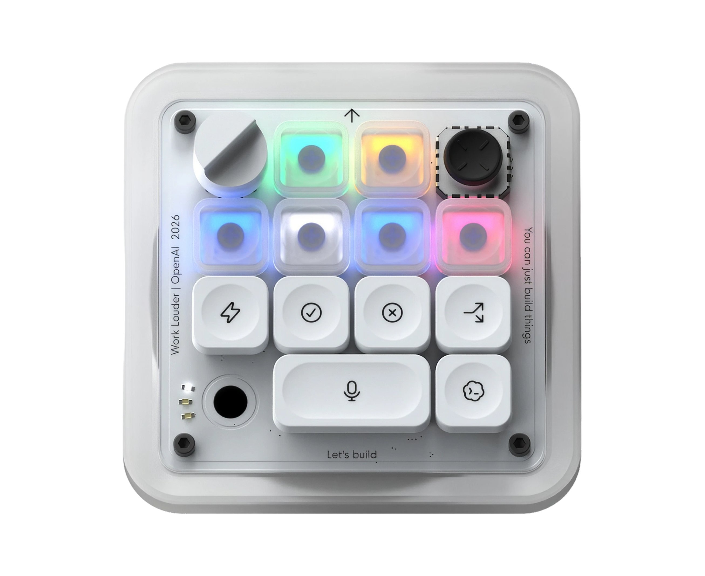
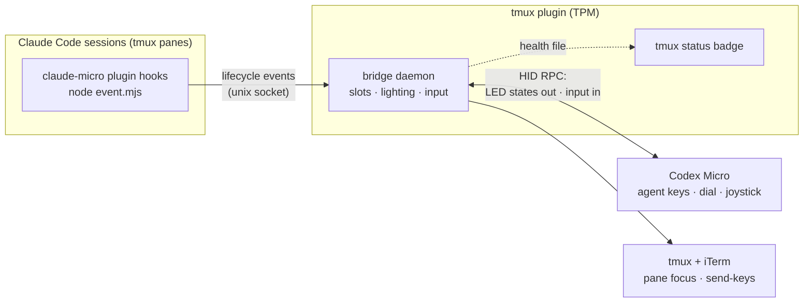

# Claude Micro

[](https://github.com/qGolem/claude-micro/actions/workflows/ci.yml)
[](./LICENSE)
[](./package.json)

macOS integration for the Work Louder / OpenAI Codex Micro, Claude Code, and
tmux: six Claude sessions get live Agent-key lighting, a frosted key focuses
the matching tmux pane, and the Micro controls drive the active pane.

<p align="center">
  
</p>

This repository is a pnpm monorepo with two packages behind two thin plugins:

- [`packages/protocol`](packages/protocol) — **codex-micro-protocol**, a pure,
  dependency-free TypeScript codec for the Codex Micro's HID RPC protocol,
  packaged with tsup as a publishable npm package (ESM + CJS + type
  declarations; build your own abstractions on top of it)
- [`packages/bridge`](packages/bridge) — the macOS bridge daemon and all
  tmux/Claude plumbing, TypeScript built to `dist/` with tsup
- a **tmux plugin** (TPM) that runs the HID bridge daemon
- a **Claude Code plugin** whose hooks forward session events to the bridge

## How it works



Each Claude Code session claims one of six agent keys; its hooks report every
lifecycle event to the bridge, which lights the key. Pressing a frosted key
flows the other way: the bridge finds the session's pane and focuses it
through tmux and iTerm.

## Requirements

- macOS, Node.js 20+, pnpm, tmux with [TPM](https://github.com/tmux-plugins/tpm), Claude Code, iTerm2
- Wired Codex Micro, with **Input Monitoring** granted to iTerm
  (System Settings → Privacy & Security → Input Monitoring)

Pane focus uses iTerm's AppleScript API; grant the macOS Automation prompt if
one appears. Other terminals keep lighting and active-pane controls but not
cross-window Agent-key focus.

## Install

Four steps. No shell commands, nothing to build.

**1.** Add the plugin to your tmux config:

```tmux
set -g @plugin 'qGolem/claude-micro'
```

**2.** Press **Prefix + I** — TPM clones the plugin.

**3.** Press **Prefix + V** — fetches the device driver and starts the bridge.

**4.** Install the Claude Code hooks, from inside Claude Code:

```
/plugin marketplace add qGolem/claude-micro
/plugin install claude-micro@claude-micro
```

Done — your Agent keys should light up on the next Claude Code session.

<details>
<summary>What step 3 does, and how to skip it</summary>

The bridge talks to the Micro through a compiled HID module, which can't live in
a git repo, and TPM has no install hook. So step 3 downloads a ~230 KB prebuilt
from this repo's [Releases](https://github.com/qGolem/claude-micro/releases),
verifies its published SHA-256, checks it actually loads, and then starts the
bridge. It is deliberately a keypress rather than something a config reload does
behind your back, and it is safe to press again — it exits immediately if the
driver is already there.

Alternatives:

- `set -g @claude_micro_auto_vendor 'on'` — do it automatically on load instead.
- `pnpm install --dir <plugin dir>` — provision it yourself from source.
- `set -g @claude_micro_vendor_key 'off'` — drop the binding entirely.

Artifacts carry signed build provenance; verify with
`gh attestation verify claude-micro-vendor-darwin-arm64.tar.gz --repo qGolem/claude-micro`.

</details>

Installing from a local checkout instead of GitHub? Use
`run-shell '/path/to/claude-micro/claude-micro.tmux'` in place of step 1, and
`/plugin marketplace add /path/to/claude-micro` in step 4.

Verify everything with **Prefix + V**'s sibling diagnostic:
`node <plugin dir>/packages/bridge/dist/doctor.js`.

## Status module

The plugin publishes a tmux command named `#{@claude_micro_status_command}`.
Wrap it in `#(...)` wherever your theme places status modules:

```tmux
set -ag status-left ' #(#{@claude_micro_status_command})'
```

The badge is green when connected; amber/red shows `↻ k` when
reconnecting/stopped — press **Prefix + k** to reset the bridge, or
**Prefix + K** to stop it.

## Configuration

Set options before the plugin line:

```tmux
set -g @claude_micro_reset_key 'k'       # restart the bridge
set -g @claude_micro_stop_key 'K'        # stop the bridge ('off' to unbind)
set -g @claude_micro_vendor_key 'V'      # install the device driver ('off' to unbind)
set -g @claude_micro_auto_vendor 'off'   # 'on' installs the driver on load instead
set -g @claude_micro_slot_bindings 'on'  # Meta-1..Meta-6 focus keys
set -g @claude_micro_auto_status 'off'   # 'on' appends the status module once
set -g @claude_micro_node '/path/node'   # pin Node: restricted-PATH tmux
                                         # servers, or to keep one version
                                         # across nvm default changes
```

**Prefix + k** restarts the bridge; **Prefix + K** stops it and releases the
HID device (it confirms with a tmux message). Starting it again is
Prefix + k, or any new tmux server.

Unpinned, the plugin resolves `node` from the tmux server's `PATH` — with nvm
that is whatever version was active when tmux started, and the scripts keep
using that absolute path afterwards. Timing knobs are environment variables
(set with `set-environment -g` before Prefix + k), all in milliseconds:

| Variable | Default | Meaning |
| --- | --- | --- |
| `CLAUDE_MICRO_AGENT_HOLD_MS` | `3000` | how long to hold an Agent key to clear its slot |
| `CLAUDE_MICRO_SLOT_STALE_MS` | `43200000` | a session silent this long (12 h) is evictable when all six keys are taken |
| `CLAUDE_MICRO_DEVICE_TIMEOUT_MS` | `2000` | HID device open/write timeout |
| `CLAUDE_MICRO_MAX_RECONNECT_BACKOFF_MS` | `30000` | cap on the device-reconnect backoff |
| `CLAUDE_MICRO_HOOK_TIMEOUT_MS` | `1500` | hook forwarder gives up on the bridge socket after this |
| `CLAUDE_MICRO_MAX_HOOK_BYTES` | `262144` | largest hook payload the daemon accepts (bytes, not ms) |

`CLAUDE_MICRO_REPLACE=1` lets a manually started daemon take over from a
running bridge — the error message that suggests it is the only time you need
it. The runtime file locations (`CLAUDE_MICRO_PID`, `_SOCKET`, `_HEALTH`,
`_SLOTS`, `_DEVICE_LOCK`; defaults under `/private/tmp`) and the vendor fetch
source (`CLAUDE_MICRO_REPO`, `_VENDOR_TAG`, `_VENDOR_BASE_URL`; defaults to
this repo's Releases) can be overridden the same way — those exist for tests
and forks, not everyday use.

## Logging

**Nothing is logged by default.** Health state is visible without it — in the
status badge and the health file — so a normal install writes no log at all.
Each sink is enabled by pointing an environment variable at a path, and each is
bounded once enabled:

| Enable with | Contents | Limit |
| --- | --- | --- |
| `CLAUDE_MICRO_LOG` | daemon stdout/stderr | rotates to `.1` past 8 MiB at each start (`CLAUDE_MICRO_MAX_LOG_BYTES`) |
| `CLAUDE_MICRO_DEBUG_DIR` | raw HID and key traces | 64 MiB per file, then stops (`CLAUDE_MICRO_MAX_DEBUG_BYTES`) |
| `CLAUDE_MICRO_LATENCY_LOG` | Agent-key focus timings | 64 MiB, then stops |
| `CLAUDE_MICRO_HOOK_AUDIT` | hook lifecycle trail (never prompt text) | 16 MiB, then stops (`CLAUDE_MICRO_MAX_AUDIT_BYTES`) |

To capture daemon output while debugging:

```tmux
set-environment -g CLAUDE_MICRO_LOG /private/tmp/claude-micro.log
```

then **Prefix + K**, **Prefix + k**. Repeated identical messages collapse to one
line per minute with a `(repeated Nx)` suffix, and reconnect attempts back off
exponentially to 30 s — so even a permanently broken device produces a few
lines per minute rather than hundreds.

## Controls


## Agent key states

| Claude Code event | Frosted Agent-key state |
| --- | --- |
| Session start/end | dim white |
| Prompt submission or tool activity | pulsing blue |
| `AskUserQuestion`, permission request, notification | pulsing amber |
| Stop/completion | solid green |
| Notification containing `error` or `failed` | pulsing red |

An idle finished session turns amber after about a minute — that is Claude
Code's ordinary "waiting for your input" notification.

## Diagnostics

`pnpm run doctor` checks Node, tmux, the vendor HID interface, dependencies,
the Claude Code plugin, the bridge health record, and socket reachability.
The bridge retries automatically on device reconnect and restores
session-to-key assignments after a restart. For temporary protocol traces,
start it with `CLAUDE_MICRO_DEBUG_DIR=/private/tmp/claude-micro-debug`.

## Uninstall

In this order — the stop scripts are part of the checkout, so stop the bridge
before deleting them out from under it (the daemon is detached and would
otherwise keep holding the HID device):

1. **Prefix + K** — stop the bridge; releases the device and removes its
   runtime files.
2. `/plugin uninstall claude-micro` in Claude Code (add
   `/plugin marketplace remove claude-micro` to drop the source too).
3. Remove the `@plugin` line from your tmux config, then **Prefix + alt + u**
   so TPM deletes the checkout — it lives in `~/.tmux/plugins/claude-micro`,
   or `~/.config/tmux/plugins/claude-micro` if your tmux config is under
   `~/.config`.
4. Restart tmux to clear the loaded key bindings and status module.

If you ever enabled logging or debug traces, their files remain under
`/private/tmp/claude-micro*` — delete them with
`rm -rf /private/tmp/claude-micro*`.

## Development

```sh
pnpm install      # also builds both packages (prepare script)
pnpm run verify   # build + typecheck + tests in every package
pnpm start        # run the built bridge in the foreground
```

`packages/bridge/dist/` is **committed on purpose**: Claude Code installs this
plugin by cloning the repo and runs the hooks with no build or install step, so
the built forwarder has to be in the checkout. Rebuild and commit it with any
bridge source change — `pnpm run verify` fails if the committed output is
stale, and the hooks' entry point is asserted to be tracked by git.

Everything is TypeScript, built with tsup. The protocol codec's tests run
under `bun test` (Bun required for development); the bridge's tests run under
`node --test` through tsx. The tmux plugin and Claude hooks execute the plain
ESM output in `packages/bridge/dist`, so end users only need Node. GitHub
Actions runs the same verification on macOS runners with Node 20 and 22.
