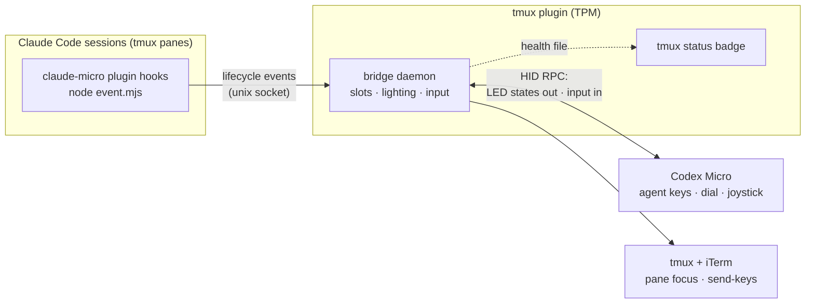
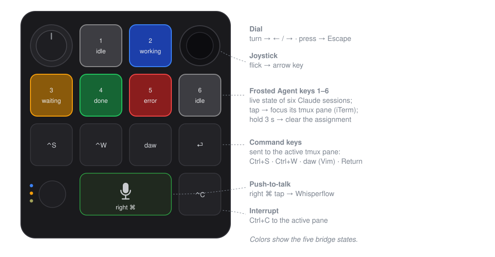

# Claude Micro

[](https://github.com/qGolem/claude-micro/actions/workflows/ci.yml)
[](./LICENSE)
[](./package.json)

macOS integration for the Work Louder / OpenAI Codex Micro, Claude Code, and
tmux: six Claude sessions get live Agent-key lighting, a frosted key focuses
the matching tmux pane, and the Micro controls drive the active pane.

This repository is a pnpm monorepo with two packages behind two thin plugins:

- [`packages/protocol`](packages/protocol) — **codex-micro-protocol**, a pure,
  dependency-free TypeScript codec for the Codex Micro's HID RPC protocol,
  packaged with tsup as a publishable npm package (ESM + CJS + type
  declarations; build your own abstractions on top of it)
- [`packages/bridge`](packages/bridge) — the macOS bridge daemon and all
  tmux/Claude plumbing, TypeScript built to `dist/` with tsup
- a **tmux plugin** (TPM) that runs the HID bridge daemon
- a **Claude Code plugin** whose hooks forward session events to the bridge

## How it works



Each Claude Code session claims one of six agent keys; its hooks report every
lifecycle event to the bridge, which lights the key. Pressing a frosted key
flows the other way: the bridge finds the session's pane and focuses it
through tmux and iTerm.

## Requirements

- macOS, Node.js 20+, pnpm, tmux with [TPM](https://github.com/tmux-plugins/tpm), Claude Code, iTerm2
- Wired Codex Micro, with **Input Monitoring** granted to iTerm
  (System Settings → Privacy & Security → Input Monitoring)

Pane focus uses iTerm's AppleScript API; grant the macOS Automation prompt if
one appears. Other terminals keep lighting and active-pane controls but not
cross-window Agent-key focus.

## Install

tmux plugin — add to your tmux config, then press **Prefix + I**:

```tmux
set -g @plugin 'qGolem/claude-micro'
```

The bridge needs its workspace dependencies (including the native HID module)
once per install/update:

```sh
pnpm install --dir ~/.tmux/plugins/claude-micro
```

Claude Code hooks — inside Claude Code:

```
/plugin marketplace add qGolem/claude-micro
/plugin install claude-micro@claude-micro
```

(For a local checkout, `/plugin marketplace add /path/to/claude-micro` works too.)

Verify everything with `pnpm --dir ~/.tmux/plugins/claude-micro run doctor`.

### Upgrading from the 0.1.x installer

The old `npm run install-plugin` flow is gone. Remove its tmux config block and
settings.json hooks once, then install as above:

```sh
cd ~/.config/tmux/plugins/claude-micro && npm run cleanup-legacy
```

## Status module

The plugin publishes a tmux command named `#{@claude_micro_status_command}`.
Wrap it in `#(...)` wherever your theme places status modules:

```tmux
set -ag status-left ' #(#{@claude_micro_status_command})'
```

The badge is green when connected; amber/red shows `↻ k` when
reconnecting/stopped — press **Prefix + k** to reset the bridge.

## Configuration

Set options before the plugin line:

```tmux
set -g @claude_micro_reset_key 'k'       # bridge reset binding
set -g @claude_micro_slot_bindings 'on'  # Meta-1..Meta-6 focus keys
set -g @claude_micro_auto_status 'off'   # 'on' appends the status module once
set -g @claude_micro_node '/path/node'   # only for restricted-PATH tmux servers
```

## Controls



## Agent key states

| Claude Code event | Frosted Agent-key state |
| --- | --- |
| Session start/end | dim white |
| Prompt submission or tool activity | pulsing blue |
| `AskUserQuestion`, permission request, notification | pulsing amber |
| Stop/completion | solid green |
| Notification containing `error` or `failed` | pulsing red |

An idle finished session turns amber after about a minute — that is Claude
Code's ordinary "waiting for your input" notification.

## Diagnostics

`pnpm run doctor` checks Node, tmux, the vendor HID interface, dependencies,
the Claude Code plugin, the bridge health record, and socket reachability.
The bridge retries automatically on device reconnect and restores
session-to-key assignments after a restart. For temporary protocol traces,
start it with `CLAUDE_MICRO_DEBUG_DIR=/private/tmp/claude-micro-debug`.

## Uninstall

Remove the `@plugin` line (Prefix + alt + u, or delete
`~/.tmux/plugins/claude-micro`) and run `/plugin uninstall claude-micro` in
Claude Code. Restart tmux to clear loaded key bindings.

## Development

```sh
pnpm install      # also builds both packages (prepare script)
pnpm run verify   # build + typecheck + tests in every package
pnpm start        # run the built bridge in the foreground
```

Everything is TypeScript, built with tsup. The protocol codec's tests run
under `bun test` (Bun required for development); the bridge's tests run under
`node --test` through tsx. The tmux plugin and Claude hooks execute the plain
ESM output in `packages/bridge/dist`, so end users only need Node. GitHub
Actions runs the same verification on macOS runners with Node 20 and 22.
